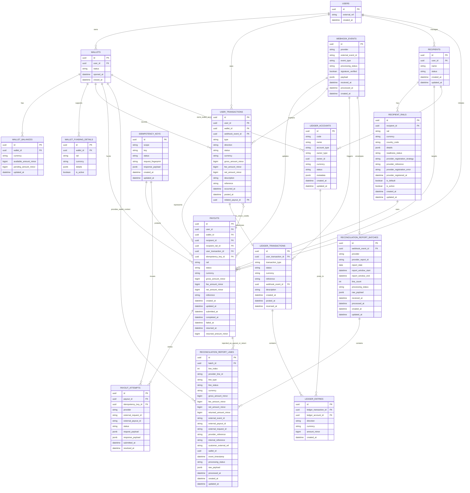

# Financial ER Diagram

This document captures the current v1 database design direction for the payment platform domain.

It is intended as a working reference for:

- wallet and balance modeling
- user-facing transaction history and statements
- payout and recipient relationships
- provider webhook and idempotency handling
- provider reconciliation report ingestion and storage
- double-entry ledger design

## ER Diagram

## Notes

- `user_transactions` is the source for user-facing history and statements.
- `ledger_transactions` and `ledger_entries` are the internal financial source of truth.
- `payouts` represents the business payout object.
- `payout_attempts` stores PSP execution and retry history.
- returned payouts stay attached to the original `payouts` row through `status`, `returned_at`, and `returned_amount_minor`.
- `user_transactions.related_payout_id` links return-credit transactions back to the original payout they compensate.
- `webhook_events` stores raw provider callbacks for deduplication, replay, and auditability.
- `reconciliation_report_batches` stores each provider report delivery as its own durable batch envelope.
- `reconciliation_report_lines` stores normalized provider observations for funding, payout, and return lines before reconciliation matching/classification.
- reconciliation report lines intentionally keep provider identifiers and wallet context without hard foreign keys to payouts or user transactions, because they may arrive before internal matching is resolved.
- `ledger_accounts` currently uses a generic ownership model with `owner_type` and `owner_id`.
- In practice, wallet liability accounts point at wallets, recipient payable accounts point at recipients, and platform accounts have no domain owner row.
- `wallet_balances` is a balance read model and must stay consistent with ledger posting.
- `recipient_rails` now carries onboarding readiness and provider-registration strategy per rail, so one recipient can have multiple payout methods in different lifecycle states.
- The current onboarding foundation uses a hybrid recipient strategy:
  - `platform_managed` rails store validated details and can be embedded later at payout submission time.
  - `provider_managed` rails are expected to register a beneficiary or transfer instrument with the PSP before they become payout-ready.

## Status

This is a working design reference and may evolve as the `design-financial-database-foundation` change is implemented.
